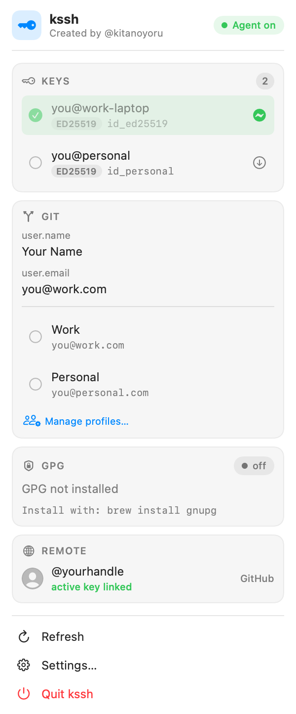

# kssh

> The macOS menu-bar app for SSH keys, Git identities, GPG, and your GitHub / GitLab / Bitbucket accounts — all in one click.

[](https://github.com/kitanoyoru/kssh/releases)
[](#homebrew-recommended)
[](https://www.apple.com/macos/)
[](https://swift.org)
[](LICENSE)

Juggling work and personal SSH keys, multiple Git identities, and a few GitHub/GitLab
accounts? **kssh** puts all of it in your menu bar. See which keys are loaded, which
identity is active, your Git and GPG config, and the remote accounts your keys belong to —
then switch any of them in **one click**, without hand-editing `~/.ssh/config` or running
`git config`. No daemon, no telemetry, secrets in the macOS Keychain.

<p align="center">
  
</p>

## Features

- **SSH keys at a glance** — see every keypair in `~/.ssh` and which are loaded in the
  agent. Each key shows its config-active state (✓) and agent-loaded state (⚡).
- **Switch identities** — pick a key to make it the active `IdentityFile`. kssh rewrites
  only the `Host` blocks that reference that key (never clobbering unrelated hosts) and
  reloads the agent. A timestamped backup is written before any edit.
- **Full key lifecycle** — generate a new key (ed25519 or RSA), rename it, or delete it
  (moved to a recoverable trash), and upload the active key to GitHub/GitLab — all from the
  menu bar.
- **Load / unload keys** — add a key to the agent (`ssh-add`) or remove it (`ssh-add -d`)
  without touching your config.
- **Git profiles** — define named identities (Work, Personal, …) and switch `user.name` /
  `user.email` globally in one tap. The active profile is highlighted.
- **GPG** — view your secret keys and create a new one (ed25519) from an in-app form.
- **Multi-account remotes** — manage multiple **GitHub, GitLab, and Bitbucket** accounts
  per service: add, label, switch the active one, test the connection, and edit or remove
  it — right from the popover. Each row shows the account's avatar, username, and a profile
  detail screen with stats and a **GitHub contribution graph**.
- **Secure by default** — Personal Access Tokens live in the macOS Keychain; kssh also
  falls back to the token in `~/.netrc` so existing setups just work.
- **Copy to clipboard** — right-click any key fingerprint, public key, email, or key id.
- **Stays out of your way** — menu-bar only (no Dock icon), collapsible sections, optional
  launch-at-login, and in-popover navigation (no extra windows).

## Requirements

- macOS 14 (Sonoma) or later
- Swift toolchain / Xcode command-line tools (to build)
- `git` on `PATH`; `gnupg` optional (only for GPG features — `brew install gnupg`)

## Install

### Homebrew (recommended)

```sh
brew tap kitanoyoru/kssh
brew install kssh
```

This builds kssh from source (it needs the Xcode toolchain), then installs a `kssh.app`
bundle into the Homebrew prefix. To launch it:

```sh
open "$(brew --prefix)/opt/kssh/kssh.app"
```

To make it show up in Launchpad / Spotlight, link it into Applications:

```sh
ln -sf "$(brew --prefix)/opt/kssh/kssh.app" /Applications/kssh.app
```

Upgrade with `brew upgrade kssh`; remove with `brew uninstall kssh`.

### From a clone

```sh
git clone https://github.com/kitanoyoru/kssh.git
cd kssh
make install        # builds a release .app and copies it to /Applications
```

Then launch **kssh** from `/Applications`. The key icon appears in your menu bar.
Uninstall with `make uninstall`.

## Build from source

```sh
make build          # debug build
make run            # build and run
make release        # release build + bundled .app under .build/release
make test           # run the test suite
```

## Usage

Click the menu-bar key icon to open the popover:

- **Keys** — tap a key to make it the active identity; use the ⚡/⬇ control on the right to
  load/unload it in the agent.
- **Git** — tap a profile to switch your global Git identity; **Manage profiles…** to add
  or edit them.
- **GPG** — **Create GPG key…** to generate one (requires `gnupg`).
- **Remote** — **Add account…** to connect a GitHub, GitLab, or Bitbucket account (pick the
  service, paste a token). Switch the active account with its radio, right-click to test /
  edit / remove, and tap a row to open its profile with stats and a contribution graph.
  Tokens are stored in the Keychain; kssh also falls back to `~/.netrc`.

General preferences (auto-refresh interval, launch-at-login) and a read-only account
summary live in **Settings**.

## How it works

kssh shells out to the standard tools you already use — `ssh-add`, `ssh-keygen`, `git`,
`gpg` — and reads/writes `~/.ssh/config` and your global Git config directly. There is no
daemon and no telemetry; everything runs locally on demand. Personal Access Tokens are
stored in the macOS Keychain.

## Contributing

Contributions are welcome! See [CONTRIBUTING.md](CONTRIBUTING.md) for dev setup, build/test
commands, code style, and the PR process. In short:

1. Fork and branch from `master`.
2. `make build && make test` must pass.
3. Keep changes focused; match the existing SwiftUI + design-token style.
4. Open a PR describing the change.

## License

[MIT](LICENSE) © Alexandr Rutkowski
